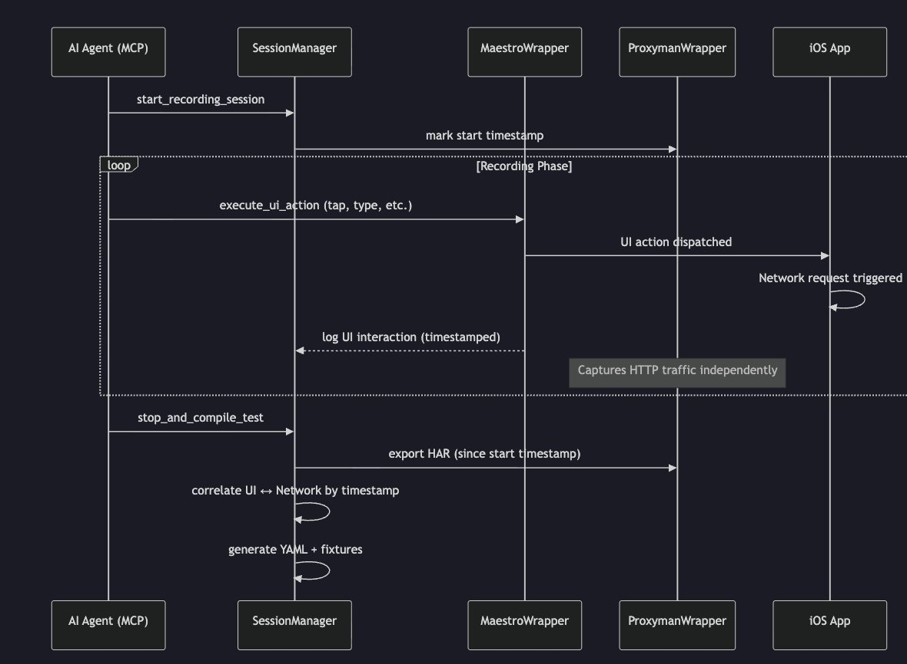

# Mobile Automator MCP Server

An [MCP](https://modelcontextprotocol.io/) server that gives AI agents the power to **record**, **replay**, and **mock** mobile app interactions — combining [Maestro](https://maestro.mobile.dev/) UI automation with [Proxyman](https://proxyman.io/) network capture to generate complete, self-contained test scripts.

## Architecture



The system orchestrates two async data streams — **UI interactions** (via Maestro) and **HTTP traffic** (via Proxyman) — then correlates them by timestamp to produce Maestro YAML + WireMock stubs for full experience replay.

## Capabilities

| Capability | Description |
|---|---|
| **UI Recording** | Dispatch taps, types, scrolls, swipes on iOS/Android simulators via Maestro |
| **Network Capture** | Intercept HTTP/HTTPS traffic through Proxyman with scoped, session-aware exports |
| **Correlation** | Automatically match UI actions to the network requests they trigger (sliding time window) |
| **YAML Synthesis** | Generate Maestro test scripts with inline network context comments |
| **WireMock Stubs** | Produce WireMock-compatible `mappings/` + `__files/` for network replay |
| **Selective Mocking** | Mock all, some, or all-except-some APIs — unmocked routes proxy to the real server |
| **SDUI Validation** | Deep-compare server-driven UI payloads against expected JSON shapes |
| **Named Flows** | Invoke hand-authored Maestro flows by name (`list_flows`, `run_flow`) to navigate to the area of an incremental change |
| **Build & Deploy** | Compile, install, uninstall, and boot simulators via `build_app` / `install_app` / `uninstall_app` / `boot_simulator` — iOS (xcodebuild + simctl) and Android (gradlew + adb) |
| **Visual Verification** | Capture PNG screenshots via `take_screenshot` (iOS `simctl io screenshot`, Android `adb exec-out screencap -p`) so the agent can inspect the rendered UI directly |
| **Unit Tests** | Run XCTest / Gradle unit tests via `run_unit_tests` and get structured pass/fail counts plus first-line failure messages — no log dumps |

## Tools

| Tool | Purpose |
|---|---|
| `start_recording_session` | Begin recording — snapshots Proxyman baseline, initializes session state |
| `execute_ui_action` | Dispatch a UI action and log it to the session |
| `get_ui_hierarchy` | Capture the current accessibility tree from the simulator |
| `get_network_logs` | Fetch intercepted HTTP traffic (with domain/path filtering) |
| `verify_sdui_payload` | Validate a network response against expected fields |
| `stop_and_compile_test` | Finalize session → export scoped HAR → correlate → generate YAML + WireMock stubs |
| `list_flows` | Discover named Maestro flows under `./flows/` (or a custom `flowsDir`) |
| `run_flow` | Execute a named flow by name, merging manifest defaults with caller-supplied params |
| `build_app` | Compile an iOS app (`xcodebuild`) or Android app (`./gradlew assemble…`); returns the built `.app` / `.apk` path |
| `install_app` | Install a built `.app` (iOS `simctl`) or `.apk` (Android `adb install -r`) on a target device |
| `uninstall_app` | Remove an installed app from a device to guarantee clean-state launches |
| `boot_simulator` | Boot an iOS simulator by UDID and wait for it to be ready (Android emulator: start manually) |
| `take_screenshot` | Capture a PNG of the current simulator/emulator screen; returns an absolute path Claude can read back |
| `run_unit_tests` | Run the unit-test target and return structured results (`passed`/`failed` counts, failing test names, first-line failure messages) |

## Quick Start

### Prerequisites

- **Node.js** v20+
- **Maestro CLI** — `curl -Ls "https://get.maestro.mobile.dev" | bash`
- **Proxyman** macOS 5.20+ with CLI — see [Proxyman Setup](docs/proxyman-setup.md)
- A booted **iOS Simulator** or **Android Emulator**

### Install

```bash
git clone <repository>
cd mobile-automator-mcp
npm install
npm run build
```

### Register with an MCP Client

Add to your MCP client config (e.g., Claude Desktop, Gemini Code Assist):

```json
{
  "mcpServers": {
    "mobile-automator": {
      "command": "node",
      "args": ["/absolute/path/to/mobile-automator-mcp/dist/index.js"]
    }
  }
}
```

## Selective Mocking

The `stop_and_compile_test` tool accepts a `mockingConfig` to control which APIs are mocked vs. proxied to a real backend:

```
full      → Mock all captured APIs (default, no real server needed)
include   → Mock only listed routes, proxy everything else
exclude   → Mock everything EXCEPT listed routes
```

**Example** — mock only login, proxy everything else:
```json
{
  "mockingConfig": {
    "mode": "include",
    "routes": ["/api/login"],
    "proxyBaseUrl": "http://localhost:3030"
  }
}
```

## Output Structure

```
session-<id>/
├── wiremock/
│   ├── mappings/           ← WireMock stub JSON files
│   │   ├── post_api_login.json
│   │   ├── get_api_lore_doom.json
│   │   └── _proxy_fallback.json   ← (include/exclude modes only)
│   └── __files/            ← Response body fixtures
│       ├── post_api_login_response.json
│       └── get_api_lore_doom_response.json
└── manifest.json           ← Session metadata + route manifest
```

## Project Structure

```
src/
├── index.ts              ← MCP server entry point
├── handlers.ts           ← Tool handler implementations
├── schemas.ts            ← Zod schemas (single source of truth for I/O)
├── types.ts              ← Domain models
├── session/              ← Session lifecycle + SQLite persistence
├── maestro/              ← Maestro CLI wrapper + hierarchy parser
├── proxyman/             ← Proxyman CLI wrapper + payload validator
├── flows/                ← Named, hand-authored flow registry
├── build/                ← iOS (xcodebuild/simctl) + Android (gradlew/adb) build & deploy
├── screenshot/           ← PNG capture for visual self-verification
├── testing/              ← XCTest / JUnit unit-test runner + result parsers
└── synthesis/            ← Correlator + YAML generator + WireMock stub writer
```

## Named Flows

Hand-authored Maestro flows let an agent navigate to a specific app screen before verifying an incremental change. Flows live as `.yaml` files in a flows directory (default: `./flows/`) and are invoked by name.

```
flows/
├── _manifest.json              ← optional: descriptions, tags, param specs
├── login.yaml                  ← flow name is "login"
└── navigate-to-checkout.yaml   ← flow name is "navigate-to-checkout"
```

An optional `_manifest.json` declares parameters and metadata:

```json
{
  "flows": {
    "login": {
      "description": "Launch the app and reach the logged-in home screen",
      "tags": ["auth", "setup"],
      "params": {
        "USERNAME": { "default": "admin", "description": "Login username" },
        "PASSWORD": { "default": "admin" }
      }
    }
  }
}
```

Params are forwarded to Maestro as `-e KEY=VALUE` and referenced inside the YAML as `${KEY}`. Call `list_flows` to discover flows, then `run_flow` with `{ name, params? }` to execute one.

## Build & Deploy Loop

Closes the edit → rebuild → reinstall → navigate cycle so an agent can verify changes against a fresh build.

```
build_app     → compile with xcodebuild / ./gradlew, return built .app or .apk path
uninstall_app → wipe the prior install + its data from the target device
install_app   → push the new binary to the simulator / emulator
boot_simulator→ boot an iOS simulator (idempotent; alreadyBooted=true if already running)
```

**iOS** — shells `xcodebuild build -scheme <scheme> -destination 'generic/platform=iOS Simulator' -derivedDataPath <path>` and locates the `.app` under `<derivedDataPath>/Build/Products/<Configuration>-iphonesimulator/`. Bundle id is extracted via `plutil` from the built `Info.plist`.

**Android** — shells `./gradlew :<module>:assemble<Variant>` from the project root and locates the APK at `<project>/<module>/build/outputs/apk/<variant>/`. Booting the emulator is not yet automated — start it manually (e.g., `emulator -avd <name>`) before calling install/run tools.

Build output is truncated (head + tail) to keep MCP responses small while preserving both the lead-up and the final error context.

## Visual Verification & Unit Tests

`take_screenshot` writes a PNG to disk and returns its path — Claude reads the image back directly, which catches visual regressions (wrong color, clipped text, broken image) that structural hierarchy checks miss. Pair it with `get_ui_hierarchy` for structural assertions.

`run_unit_tests` runs the normal unit-test target for the project:

- **iOS** — `xcodebuild test -resultBundlePath <path>` with optional `-only-testing:<Target>/<Class>[/<Method>]` filters. The stdout is parsed for per-test pass/fail so totals stay accurate across Xcode versions.
- **Android** — `./gradlew :<module>:test<Variant>UnitTest` with an optional `--tests <filter>`. JUnit XML under `<module>/build/test-results/<task>/` is parsed for failure details.

Both return structured results: `{ passed, totalTests, passedTests, failedTests, skippedTests, failures[] }`. `failures[]` carries the failing test name and (where available) the first-line error message plus source file/line — enough for the agent to jump straight to the offending code without grepping the full log.

The full agent workflow (build → install → navigate → screenshot → unit test → iterate) is documented in [.agents/skills/agent-loop.md](.agents/skills/agent-loop.md).

## Development

```bash
npm test            # Run tests
npm run test:watch  # Watch mode
npm run build       # Compile TypeScript
npm start           # Start server (stdio)
npm run lint        # ESLint
```

## License

MIT
