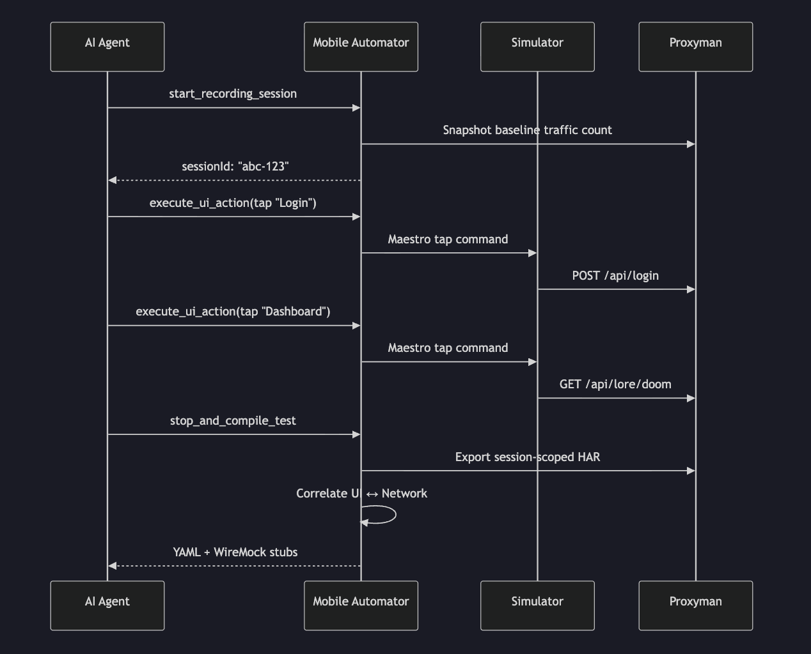
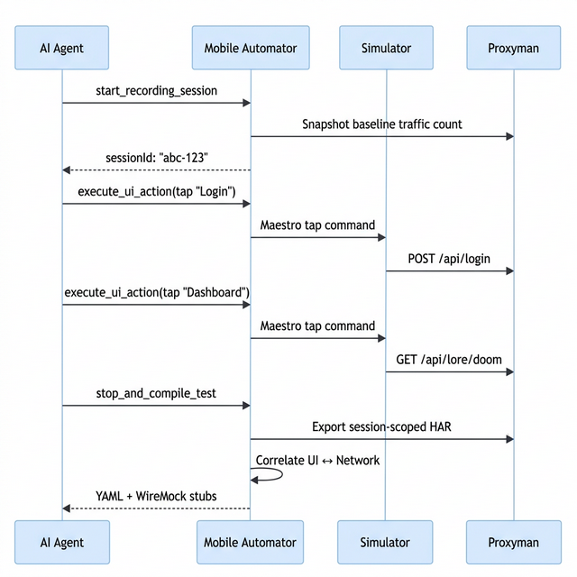
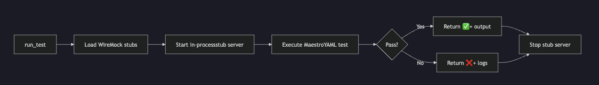

# Mobile Automator MCP — Technical Showcase

> **AI-Powered Mobile Test Automation at Scale**
> Record once, replay everywhere — with full network fidelity.

---

## The Problem

Mobile test automation today is **manual, brittle, and disconnected from the network layer**. Engineers write Maestro/XCUITest scripts by hand, mock APIs separately, and maintain two independent artifact sets that drift apart over time. When a team has 50+ test flows across iOS and Android, this doesn't scale.

## The Solution

**Mobile Automator MCP** is an AI-native test automation server that sits between an AI coding agent and mobile simulators. It **records** what a user does (taps, types, scrolls), **captures** every API call the app makes, **correlates** the two by timestamp, and **synthesizes** complete, self-contained test scripts — all in a single recording session.



---

## Core Capabilities

| Capability | What It Does | Why It Matters |
|---|---|---|
| **🎬 UI Recording** | Dispatches taps, types, scrolls, swipes on iOS & Android simulators via Maestro | Cross-platform from day one |
| **🌐 Network Capture** | Intercepts all HTTP/HTTPS traffic through Proxyman with session-scoped exports | No traffic leaks between parallel sessions |
| **🔗 Correlation Engine** | Matches UI actions → network requests via a sliding time window (configurable, default 3s) | Knows that "tap Login" triggered `POST /api/login` |
| **📝 YAML Synthesis** | Generates Maestro test scripts with inline network context comments | Tests document themselves |
| **🧪 WireMock Stubs** | Produces `mappings/` + `__files/` for deterministic network replay | Tests run without a live backend |
| **🎛️ Selective Mocking** | Mock all, some, or all-except-some APIs — unmocked routes proxy to the real server | Incremental adoption, no big-bang migration |
| **🔍 SDUI Validation** | Deep-compares server-driven UI payloads against expected JSON shapes | Catches backend regressions before they hit users |
| **🧩 Segment Registry** | Fingerprints and deduplicates common flows (e.g., login) across test suites | One login segment, reused by 50 tests |

---

## How It Works — End-to-End Workflow

### Phase 1: Record a User Flow

The AI agent drives the simulator through a user flow while the MCP server records every action and API call:



### Phase 2: Synthesize Artifacts

The `stop_and_compile_test` tool produces three outputs in a single call:

````carousel
**Maestro YAML** — Ready-to-run test script with network context
```yaml
appId: com.doombot.app
---
- launchApp

# ── Tap Login (POST /api/login → 200) ──
- tapOn:
    id: "login_button"
- inputText: "admin"

# ── Tap Dashboard (GET /api/lore/doom → 200) ──
- tapOn:
    text: "Dashboard"
- assertVisible:
    text: "Welcome back"
```
<!-- slide -->
**WireMock Stubs** — Deterministic network replay
```
session-abc-123/
├── wiremock/
│   ├── mappings/
│   │   ├── post_api_login.json
│   │   ├── get_api_lore_doom.json
│   │   └── _proxy_fallback.json
│   └── __files/
│       ├── post_api_login_response.json
│       └── get_api_lore_doom_response.json
└── manifest.json
```
<!-- slide -->
**Manifest** — Session metadata and route index
```json
{
  "sessionId": "abc-123",
  "createdAt": "2026-03-08T10:30:00Z",
  "mockingConfig": { "mode": "include",
    "routes": ["/api/login"],
    "proxyBaseUrl": "http://localhost:3030"
  },
  "routes": [
    { "method": "POST", "path": "/api/login",
      "fixtureFile": "post_api_login_response.json",
      "statusCode": 200 }
  ]
}
```
````

### Phase 3: Execute with Orchestration

The `run_test` tool handles the full lifecycle — spin up a stub server, run Maestro, report results:



> **Zero-dependency stub server** — No Java, no WireMock JAR. The test runner includes a lightweight Node.js HTTP server that loads WireMock-format mappings natively.

---

## Scaling Features

### Segment Deduplication

When 30 tests all start with "login," the **Segment Registry** prevents duplication:

1. **Fingerprint** — SHA-256 hash of `(action, target, endpoints)` sequence; timestamps excluded so identical flows always match
2. **Registry** — JSON-persisted mapping of fingerprints → named segments with YAML + stub paths
3. **Similarity** — Jaccard similarity scoring detects partial overlaps across recordings

```
tap|login_button|POST:/api/login → type|username_field| → tap|submit|
                    ↓
         SHA-256 → "a3f7c2e91b04"
                    ↓
        Registry: "login" → segments/login.yaml
```

### Concurrent CI Sessions

Port-isolation enables parallel test execution on a single Mac:

```
Runner 1: filterDomains=["localhost.proxyman.io:3031"] → test-server :3031
Runner 2: filterDomains=["localhost.proxyman.io:3032"] → test-server :3032
Runner 3: filterDomains=["localhost.proxyman.io:3033"] → test-server :3033
```

Each session's Proxyman baseline is domain-scoped — **zero cross-session traffic leakage**.

---

## MCP Tool Inventory

The server exposes **8 tools** via the Model Context Protocol, callable by any MCP-compatible AI agent (Claude, Gemini Code Assist, etc.):

| # | Tool | Purpose |
|---|---|---|
| 1 | `start_recording_session` | Begin recording — snapshots Proxyman baseline, initializes session state |
| 2 | `execute_ui_action` | Dispatch tap/type/scroll/swipe/back/assertVisible on the simulator |
| 3 | `get_ui_hierarchy` | Capture the live accessibility tree (normalized: id → label → text) |
| 4 | `get_network_logs` | Fetch intercepted HTTP traffic with domain/path filtering |
| 5 | `verify_sdui_payload` | Validate a network response against expected JSON fields |
| 6 | `stop_and_compile_test` | Finalize → export HAR → correlate → generate YAML + WireMock stubs |
| 7 | `register_segment` | Fingerprint and register a reusable flow segment |
| 8 | `run_test` | Load stubs → start server → run Maestro → report results |

---

## Technical Stack

| Layer | Technology | Rationale |
|---|---|---|
| Runtime | Node.js ≥ 20, ESM | Broad toolchain compatibility |
| Language | TypeScript 5, strict mode | Type safety without runtime overhead |
| Schema | Zod | Single source of truth — compile-time types + runtime validation |
| Persistence | sql.js (in-process SQLite) | No native compilation, portable across VMs |
| Transport | stdio (MCP SDK) | Standard agent protocol |
| UI Automation | Maestro CLI | Cross-platform (iOS + Android), no Xcode/Android Studio dependency |
| Network Capture | Proxyman CLI | macOS-native HTTPS interception with HAR export |
| Test Doubles | WireMock-compatible format | Industry standard, portable to Java-based CI |

---

## Key Differentiators

> [!IMPORTANT]
> This is not a "record and playback" tool. It's an **AI-led test synthesis engine** that produces **network-hermetic, self-documenting test suites**.

| Traditional Approach | Mobile Automator |
|---|---|
| Engineer writes UI tests manually | AI agent records and generates tests |
| Network mocks maintained separately | Stubs co-generated from live traffic |
| Tests break when APIs change | SDUI validation catches drift early |
| Login flow duplicated in every test file | Segment registry deduplicates shared flows |
| One test at a time on CI | Port-isolated concurrent sessions |
| Requires WireMock JAR + Java on CI runners | In-process Node.js stub server — zero external deps |

---

## Production Readiness

- ✅ **Comprehensive test suite** — Vitest with co-located `*.test.ts` files covering correlator, generator, stub writer, fingerprinting, and SDUI validator
- ✅ **Strict TypeScript** — No `any` types; ESLint enforced
- ✅ **CI-friendly** — `npm test && npm run build` as pre-flight gate
- ✅ **Cross-platform** — iOS and Android from the same tool surface
- ✅ **MCP standard** — Works with any MCP-compatible AI agent today and in the future
